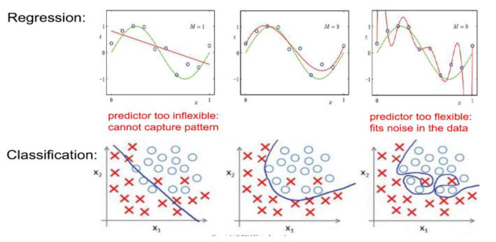
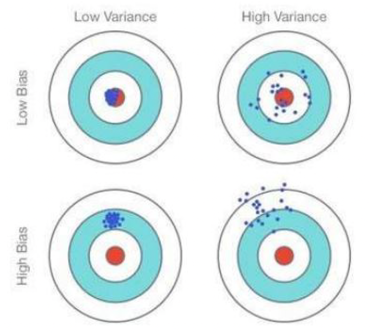
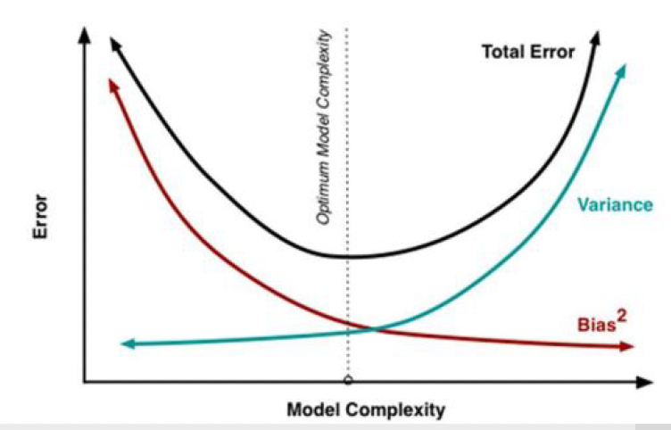

# Learning from data

At a high level, machine learning algorithms can be grouped based on the type of data they work with: labeled or unlabeled data. Let's go deeper into each of the learning types and their application to classification and regression tasks.

### 1. **Supervised Learning (for labeled data)**

Supervised learning refers to the scenario where we have labeled data, meaning that each data point has a corresponding label or target value. The goal is to learn a mapping from input features to these labels so that we can make predictions on unseen data.

#### a) **Classification**

In classification, the goal is to predict a category or class label from the data. For example, determining whether an email is spam or not, based on features like words used in the email.

- **Classification** is used when the target variable $Y$ is **categorical** (e.g., spam or not spam).
- The output $Y$ can take one of a finite set of values (classes).
  
##### Formula:

If we have a dataset $D$ with features $X = \{ x_1, x_2, ..., x_n \}$ and a target label $Y$ that belongs to a set of classes $C = \{c_1, c_2, ..., c_k \}$, then the task is to find a function $f(X)$ that maps $X$ to one of the classes $c$.

Mathematically, the problem is:
```math
f: X \rightarrow C
```
where $f$ is the classification function, and $C$ is the set of possible class labels.

Common algorithms for classification:
- Logistic Regression
- Decision Trees
- Support Vector Machines (SVM)
- k-Nearest Neighbors (k-NN)

#### b) **Regression**

In regression, the objective is to predict a continuous value (real number). For example, predicting the price of a house based on its features (square footage, number of bedrooms, etc.).

- **Regression** is used when the target variable $Y$ is **continuous**.
- The output Y is a real number, and we aim to approximate the relationship between the input features and the continuous target.

##### Formula:

Given a dataset $D$ with features $X = \{ x_1, x_2, ..., x_n \}$ and continuous target values $Y$, the objective is to learn a function $f(X)$ that predicts a continuous value for Y.

Mathematically:
```math
f: X \rightarrow Y
``` 
where $Y$ is a continuous variable.

In linear regression, for example, the model would look like this:
```math
y = \beta_0 + \beta_1 x_1 + \beta_2 x_2 + ... + \beta_n x_n + \epsilon
``` 
where:
- $y$ is the predicted continuous value (e.g., house price),
- $x_1, x_2, ..., x_n$ are the features (e.g., square footage, number of bedrooms),
- $\beta_0, \beta_1, ..., \beta_n$ are the coefficients (parameters) that we learn from the data,
- $\epsilon$ is the error term (difference between predicted and actual value).

Common algorithms for regression:
- Linear Regression
- Decision Trees
- Random Forests
- Support Vector Machines for regression (SVR)

### 2. **Unsupervised Learning (for unlabeled data)**

Unsupervised learning is used when you have data without explicit labels or target values. The goal here is often to find patterns or structures in the data.

#### a) **Clustering**

In clustering, the goal is to group similar data points together, so that points within the same group (cluster) are more similar to each other than to points in other groups. This is typically used for customer segmentation, document clustering, or image segmentation.

- **Clustering** algorithms do not rely on labels.
- The output is a grouping of data points based on similarity.

One of the most common clustering algorithms is **k-means**. The idea is to partition data points into $k$ clusters, where each cluster is represented by the mean (centroid) of the points in that cluster.

##### Formula for k-means:
1. Choose $k$ initial centroids (randomly or using some heuristic).
2. Assign each data point to the nearest centroid:
```math
c_i = \arg \min_{j} \| x_i - \mu_j \|^2
``` 
where $\mu_j$ is the centroid of cluster $j$, and $x_i$ is a data point.

3. Recalculate the centroids by averaging the points in each cluster:
```math
\mu_j = \frac{1}{|C_j|} \sum_{i \in C_j} x_i
``` 
where $C_j$ is the set of points assigned to cluster $j$, and $|C_j|$ is the number of points in cluster $j$.

### 3. **Reinforcement Learning (for reward-based data)**

Reinforcement learning involves an agent that interacts with an environment and learns to make decisions based on rewards or penalties. The agent receives feedback in the form of rewards (positive) or penalties (negative) and adjusts its behavior to maximize cumulative rewards over time.

- **Reinforcement learning** typically involves sequential decision-making.
- It uses **reward signals** to learn.

Common algorithms:
- Q-Learning
- Deep Q Networks (DQN)

### 4. **Self-Supervised Learning (for both labeled and unlabeled data)**

Self-supervised learning is a hybrid approach that combines aspects of supervised and unsupervised learning. The algorithm uses parts of the data as "pseudo-labels" and tries to predict them. For instance, predicting the next word in a sentence given the previous ones (in natural language processing) or predicting missing parts of an image.

- **Self-supervised learning** can work with both labeled and unlabeled data.
- It can be seen as a way to create labels from unlabeled data.

### **Summary**

- **Supervised learning** is when you have labeled data and can either classify (categorical target) or regress (continuous target).
- **Unsupervised learning** deals with unlabeled data and is used for tasks like clustering.
- **Reinforcement learning** is based on reward data, where the goal is to maximize cumulative rewards.
- **Self-supervised learning** is a technique that blends labeled and unlabeled data to create pseudo-labels and learn from them.

# Generative models vs Discriminative models

Generative and discriminative models are two fundamental approaches in machine learning, each with distinct objectives and methods for handling data. Let's break them down further, focusing on their key differences, how they work, and their applications.

### **Generative Models**

Generative models focus on understanding the *underlying process* that generates the data. In other words, these models aim to model the joint probability distribution of the input features $X$ and the output labels $Y$.

#### **Key Concepts:**
- **Joint Probability Distribution:** Generative models estimate the joint probability $P(X, Y)$, which represents how likely the input $X$ and the output $Y$ are to occur together. From this, they can also calculate the conditional probability $P(Y|X)$ using **Bayes' Theorem**:
  
  

  
  Here:
  - $P(Y|X)$ is the posterior probability (what we're interested in: the probability of $Y$ given $X$),
  - $P(X|Y)$ is the likelihood (how likely the data $X$ is given the label $Y$),
  - $P(Y)$ is the prior probability (how likely label $Y$ is before observing $X$),
  - $P(X)$ is the marginal likelihood (the total probability of the data).
  
- **Modeling the Data:** Generative models try to learn how the data is generated, which allows them to simulate new instances of data. By modeling both the input and output together, these models can handle missing data or generate new samples (for example, in image generation tasks).

#### **Example Algorithms:**
1. **Naïve Bayes:** Assumes that the features $X$ are conditionally independent given the class $Y$. This simplifies the computation of $P(X|Y)$, allowing for efficient classification. Despite its simplicity, Naïve Bayes can perform well for certain tasks like text classification.
2. **Hidden Markov Models (HMM):** Used for sequential data (like time series or speech), where the system is assumed to be a Markov process with hidden states. The model learns the transitions between these hidden states and generates observations accordingly.
3. **Dimensionality Reduction Techniques (e.g., PCA):** These techniques try to model how the data is distributed in high-dimensional space and reduce it to a lower-dimensional representation. While they focus on the data generation process, they can be used for feature extraction in classification tasks.

#### **Advantages:**
- Can generate new data points or handle missing data.
- Provide insight into how data is distributed across different classes.
  
#### **Disadvantages:**
- Sensitive to outliers, since these models learn the entire distribution, and outliers can skew the estimates of $P(X|Y)$ and $P(Y)$.
- Can be computationally intensive, especially when modeling complex distributions.

### **Discriminative Models**

Discriminative models, on the other hand, focus on directly learning the decision boundary between classes. These models do not attempt to model the data generation process; instead, they focus on modeling the conditional probability $P(Y|X)$, which is the probability of the label $Y$ given the input $X$.

#### **Key Concepts:**
- **Conditional Probability:** Discriminative models directly estimate $P(Y|X)$, the probability that a given input $X$ belongs to a particular class $Y$. By modeling this directly, discriminative models can make more accurate predictions because they focus only on distinguishing between classes rather than modeling how the data is generated.
  
  Unlike generative models, discriminative models **do not attempt to model $P(X)$**, the distribution of the data, and therefore they focus only on the class boundaries.

- **Learning Decision Boundaries:** Discriminative models essentially "draw" a decision boundary in the feature space that separates different classes. This boundary minimizes classification error by maximizing the margin between classes (in the case of SVMs) or directly optimizing for the likelihood of correct classification (in the case of logistic regression).

#### **Example Algorithms:**
1. **Logistic Regression:** A linear model for binary classification, where the output is modeled as a logistic (sigmoid) function of the input features. It directly estimates $P(Y=1|X)$ for binary outcomes.
2. **Support Vector Machines (SVM):** A classifier that tries to find the optimal hyperplane that maximizes the margin between the classes in the feature space. SVMs are effective in high-dimensional spaces and are robust to overfitting, especially with a small number of training examples.
3. **Decision Trees:** A hierarchical model that recursively splits the feature space based on feature values to separate the classes. It is a powerful and interpretable model for classification tasks.
4. **Random Forest:** An ensemble of decision trees that aggregates the predictions of multiple trees to improve accuracy and reduce overfitting.

#### **Advantages:**
- Typically more accurate for classification tasks because they focus only on the decision boundary.
- More robust to outliers, since they are not trying to model the entire data distribution but rather just distinguishing between classes.

#### **Disadvantages:**
- Cannot generate new data points.
- Prone to misclassification in cases where the classes overlap or are not linearly separable (especially for simple models like logistic regression or decision trees).

### **Generative vs. Discriminative Models: Summary**

| **Aspect**                        | **Generative Models**                                  | **Discriminative Models**                               |
|-----------------------------------|--------------------------------------------------------|--------------------------------------------------------|
| **Focus**                         | Models the joint distribution $P(X, Y)$               | Models the conditional distribution $P(Y\|X)$          |
| **Key Objective**                 | Explains how data was generated                        | Classifies data by finding a decision boundary          |
| **Example Algorithms**            | Naïve Bayes, HMM, PCA, Dimensionality Reduction         | Logistic Regression, SVM, Decision Trees, Random Forest |
| **Robustness to Outliers**        | Sensitive to outliers                                  | More robust to outliers                                |
| **Ability to Handle Missing Data**| Can generate new data points or handle missing data    | Cannot generate new data                               |
| **Computational Complexity**      | Often more computationally expensive                   | Often more computationally efficient                   |
| **Usage**                         | Data generation, density estimation                    | Classification, predicting labels                      |

### **Choosing Between Generative and Discriminative Models**

- **Generative models** are typically more useful when you want to simulate new data or when you have a small amount of data and need to understand the distribution of features and labels. They're also useful for tasks where data is missing or incomplete.
  
- **Discriminative models** are generally preferred when the primary task is classification, and you're aiming for higher accuracy in distinguishing between classes. They are usually more robust and simpler to train than generative models, especially for large datasets where the generation process isn't as important.

# Linear Regression

### What is Linear Regression?

Linear regression is a method used to model the relationship between a set of input variables and a continuous output variable. It's called "linear" because the relationship between the inputs and the output is represented as a straight line (or hyperplane in higher dimensions).

In simple terms, linear regression tries to find the best straight line that fits the data points. Imagine you have a scatter plot, and you want to draw a line that goes through the middle of the points, as close as possible to all of them.

### The Linear Regression Formula

The general form of a linear regression model is:

```math
\hat{y} = \beta_0 + \beta_1 x_1 + \beta_2 x_2 + \dots + \beta_d x_d
``` 

Here:
- $\hat{y}$ is the predicted output (the value you want to estimate).
- $\beta_0$ is the intercept (the value of $y$ when all inputs are zero).
- $\beta_1, \beta_2, \dots, \beta_d$ are the coefficients (slopes) for each input variable.
- $x_1, x_2, \dots, x_d$ are the input features (the data you have for each observation).

## Simple Linear Regression (1D Case)

Let’s start with a simple example where there is just one input variable (like $x_1$) and one output variable $y$ (i.e., $d = 1$ and $m = 1$).

The model would look like this:

```math
Y = \beta_0 + \beta_1 x_1
``` 

This equation means that $Y$ (the output) is a straight line that depends on the input $x_1$. The term $\beta_0\$ is the starting point (the intercept) on the $y$-axis when $x_1 = 0$, and $\beta_1$ is the slope of the line, which tells us how much $Y$ changes when $x_1$ changes.

### Training the Model

To use this equation to make predictions, we need to find the best values for $\beta_0$ and $\beta_1$. This is where the **training data** comes in. You have a set of real data points with known values of $x_1$ (inputs) and $y$ (outputs). Your goal is to find $\beta_0$ and $\beta_1$ such that the line fits the data as well as possible.

To do this, we use a method called **Least Squares Estimation**, which minimizes the difference between the predicted values and the actual values of $y$ (the real data points).

### Mean Squared Error (MSE)

The difference between the predicted value $\hat{y}$ and the actual value $y$ is called the **error**. To measure how well our model fits the data, we use **Mean Squared Error (MSE)**, which is calculated as:

```math
MSE = \frac{1}{n} \sum_{i=1}^{n} (y_i - \hat{y}_i)^2
``` 

Where:
- $n$ is the total number of data points,
- $y_i$ is the actual value of the output for the $i$-th data point,
- $\hat{y}_i$ is the predicted value for the $i$-th data point.

The MSE calculates the average of the squared differences between the actual values and the predicted values. The reason we square the differences is to ensure that both positive and negative errors are treated equally, and also to penalize larger errors more.

### Goal: Minimize the MSE

The goal of linear regression is to adjust $\beta_0$ and $\beta_1$ so that the MSE is as small as possible. In other words, we want the predicted values $\hat{y}_i$ to be as close as possible to the actual values $y_i$.

### After Training: Predictions

Once we have the best values for $\beta_0$ and $\beta_1$ (the ones that minimize the MSE), we can use the equation $Y$ = $\beta_0$ + $\beta_1$ $x_1$ to make predictions on new data. For any new value of $x_1$, you can plug it into the equation and get the predicted $y$ value.

### Recap of Steps:
1. **Define the model:** $Y$ = $\beta_0$ + $\beta_1$ $x_1$.
2. **Train the model:** Find $\beta_0$ and $\beta_1$ that minimize the MSE, i.e., minimize the difference between the predicted and actual $y$ values.
3. **Make predictions:** Once the model is trained, use it to predict the output for new input values.

### Why is it called "Curve Fitting"?

Linear regression is also known as **curve fitting** because it fits a curve (or in this case, a straight line) to the data. It tries to find the best-fitting line that minimizes the error between the predicted and actual values.

### Simple Example:

Suppose you have the following data points for $x_1$ and $y$:

| $x_1$ | $y$ |
|--------|------|
| 1      | 2    |
| 2      | 3    |
| 3      | 5    |
| 4      | 6    |

You would use linear regression to find the best line that fits these points. After applying the least squares method, you might get something like this:

```math
\hat{y} = 1 + 1.2 x_1
``` 

This means that for every increase of 1 in $x_1$, $y$ increases by 1.2 units, starting from a value of 1 when $x_1 = 0$.

### Conclusion

Linear regression is a simple yet powerful method for predicting continuous values. It works by finding the line (or curve in higher dimensions) that best fits the data, minimizing the errors between predicted and actual values. The process of training the model involves adjusting parameters to minimize the error and make the best possible predictions.

## Multiple Linear Regression (Higher-Dimensional Case)
 
This case is an extension of linear regression to handle multiple input features (i.e., $d > 1$), making it a **multiple linear regression** problem.

### Setup and Notation

- You have $n$ data points, each with $d$ features. For each data point $i$, the input $x_i$ is a vector in $\mathbb{R}^d$, and the output $y_i$ is a scalar in $\mathbb{R}$.
- We represent the input data as a matrix $X$, where each row corresponds to a data point, and each column corresponds to a specific feature. The vector $y$ contains the corresponding output values.

#### The Model:
The general multiple linear regression model is represented as:

```math
Y = X B
```

Where:
- $Y$ is the vector of outputs (size $n$ by 1),
- $X$ is the design matrix (size $n$ by ($d+1$), including a column of ones to account for the intercept $\beta_0$ and $d$ columns for the features $x_1, x_2, \dots, x_d$,
- $B$ is the vector of coefficients (size $d+1$ by 1), where each element corresponds to a specific parameter: $\beta_0, \beta_1, \dots, \beta_d$.

So, the matrix form of the equation is:

```math
\begin{bmatrix}
y_1 \\
y_2 \\
\vdots \\
y_n
\end{bmatrix}
=
\begin{bmatrix}
1 & x_{11} & x_{12} & \dots & x_{1d} \\
1 & x_{21} & x_{22} & \dots & x_{2d} \\
\vdots & \vdots & \vdots & \ddots & \vdots \\
1 & x_{n1} & x_{n2} & \dots & x_{nd}
\end{bmatrix}
\begin{bmatrix}
\beta_0 \\
\beta_1 \\
\vdots \\
\beta_d
\end{bmatrix}
```

Here:
- $Y$ is a column vector containing the actual output values for all data points.
- $X$ is the design matrix, where the first column is all 1's (for the intercept term $\beta_0$), and the remaining columns are the feature values.
- $B$ is the vector of coefficients (the parameters we want to estimate).

### Objective: Minimize the Cost Function

The goal of linear regression is to find the values of $B$ (the coefficients) that minimize the difference between the predicted values $\hat{y}_i$ and the actual values $y_i$ for all data points.

The cost function (also known as the **loss function**) used to measure the error is the **Mean Squared Error (MSE)**, given by:

```math
J(B) = \frac{1}{2n} \sum_{i=1}^{n} (y_i - \hat{y}_i)^2
```

Where:
- $y_i$ is the actual value for the $i$-th data point,
- $\hat{y}_i = X_i B$ is the predicted value for the $i$-th data point (using the current estimate of $B$).

Since the model $Y = X B$ uses matrix notation, we can rewrite the cost function in matrix form as:

```math
J(B) = \frac{1}{2n} (Y - X B)^T (Y - X B)
```

This is the sum of squared residuals (the differences between the actual and predicted values), averaged over all data points.

### Minimizing the Cost Function

To minimize the cost function $J(B)$, we need to find the value of $B$ that minimizes this expression. This can be done by taking the **derivative** of $J(B)$ with respect to $B$ and setting it equal to zero (this is a standard method in optimization). The solution is:

```math
B = (X^T X)^{-1} X^T Y
```

#### Explanation:
- $X^T$ is the transpose of the matrix $X$.
- $X^T X$ is the matrix product of $X^T$ and $X$, which is a square matrix of size ($d+1$) $\times$ ($d+1$).
- $(X^T X)^{-1}$ is the inverse of the matrix $X^T X$, and it exists as long as $X^T X$ is **non-singular** (i.e., it has full rank).
- $X^T Y$ is the matrix product of $X^T$ and the vector $Y$, which gives a vector of size $(d+1)$ $\times$ $1$.

So, by multiplying $(X^T X)^{-1} X^T Y$, we get the vector $B$ that minimizes the cost function and provides the **best-fit** coefficients for the regression model.

### Conclusion

In summary:
1. **Model**: $Y = X B$, where $Y$ is the output, $X$ is the design matrix, and $B$ is the vector of coefficients.
2. **Cost Function**: The objective is to minimize $J(B) = \frac{1}{2n} (Y - X B)^T (Y - X B)$, the Mean Squared Error between the actual and predicted values.
3. **Solution**: The optimal coefficients $B$ are found using the formula $B = (X^T X)^{-1} X^T Y$.

This formula is the core of multiple linear regression, and it allows you to compute the coefficients that give the best fit to your data.

## Multiple-Output Regression

This case describes an extension of the previous **multiple linear regression** to a situation where you have **multiple outputs** (i.e., \($Y$ $\in$ $\mathbb{R}^{n \times 2}$)) instead of just a single output. This type of model is also known as **multivariate linear regression**.

### Notation and Setup

- You have $n$ data points, each with $d$ features.
- Each data point has **2 output values** (so $Y$ is now a matrix of size \($n \times 2$).
- Each output value corresponds to a vector in $\mathbb{R}^2$, so the target output for each data point is a pair of values $(y_{i1}, y_{i2})$.

### Model Representation

The linear model is:

```math
Y = X B
```

Where:
- $Y$ is the matrix of outputs (size $n \times 2$),
- $X$ is the **design matrix** (size $n$ $\times$ ($d+1$), which includes a column of ones (for the intercept term \($\beta_0\$)) and $\(d\)$ columns for the input features \($x_1$, $x_2$, $\dots$, $x_d$\),
- $B$ is the coefficient matrix (size \($d+1$) $\times$ $2$\) where each column corresponds to the coefficients of one of the two output variables.

The equation can be written as:

```math
\begin{bmatrix}
y_{11} & y_{12} \\
y_{21} & y_{22} \\
\vdots & \vdots \\
y_{n1} & y_{n2}
\end{bmatrix}
=
\begin{bmatrix}
1 & x_{11} & x_{12} & \dots & x_{1d} \\
1 & x_{21} & x_{22} & \dots & x_{2d} \\
\vdots & \vdots & \vdots & \ddots & \vdots \\
1 & x_{n1} & x_{n2} & \dots & x_{nd}
\end{bmatrix}
\begin{bmatrix}
\beta_{10} & \beta_{20} \\
\beta_{11} & \beta_{21} \\
\vdots & \vdots \\
\beta_{1d} & \beta_{2d}
\end{bmatrix}
```

Where:
- Each $y_{i1}$ and $y_{i2}$ represent the two outputs for the $i$-th data point,
- The matrix $B$ contains the coefficients that will be estimated.

### Objective: Minimize the Cost Function

The cost function (also known as the loss function) measures how well the model's predictions match the actual outputs. The cost function for this model is the **Mean Squared Error (MSE)**, given by:

```math
J(B) = \frac{1}{2n} \sum_{i=1}^{n} \left( (y_{i1} - \hat{y}_{i1})^2 + (y_{i2} - \hat{y}_{i2})^2 \right)
```

Where:
- $y_{i1}$ and $y_{i2}$ are the actual values for the $i$-th data point,
- $`\hat{y}_{i1}`$ and $\hat{y}_{i2}$  are the predicted values for the $i$-th data point.

In matrix form, this can be written as:

```math
J(B) = \frac{1}{2n} \left( Y - X B \right)^T \left( Y - X B \right)
```

Where:
- $Y$ is the matrix of actual outputs \($n \times 2$\),
- $X$ is the design matrix \($n$ $\times$ ($d+1$)\),
- $B$ is the matrix of coefficients \($(d+1) \times 2$\).

### Minimizing the Cost Function

The goal of linear regression is to find the value of $B$ that minimizes the cost function $J(B)$. To do this, we take the derivative of $J(B)$ with respect to $B$ and set it equal to zero. This yields the solution:

```math
B = (X^T X)^{-1} X^T Y
```

#### Explanation:
- $X^T$ is the transpose of the matrix $X$,
- $X^T X$ is the matrix product of $X^T$ and $X$, which results in a square matrix of size $\(d+1) \times (d+1)$,
- $\(X^T X)^{-1}$ is the inverse of $X^T X$ (it must be invertible for this solution to exist),
- $X^T Y$ is the matrix product of $X^T$ and $Y$, which is a matrix of size $\(d+1) \times 2$.

The result is that the coefficient matrix $B$ (of size \($d+1$) $\times$ 2\) can be computed using the formula:

```math
B = (X^T X)^{-1} X^T Y
```

### How the Formula Works

The formula $\(X^T X)^{-1} X^T Y$ gives you the optimal values for the coefficient matrix $B$ by minimizing the squared differences between the predicted and actual values. Since there are two output variables, $B$ has two columns, each corresponding to the coefficients for one of the output variables.

### Conclusion

To summarize:
1. **Model**: The linear model is $Y = X B$, where $Y$ is the matrix of outputs, $X$ is the design matrix, and $B$ is the coefficient matrix.
2. **Cost Function**: The goal is to minimize the Mean Squared Error, $J(B)$, between the predicted and actual outputs.
3. **Solution**: The optimal coefficients are computed using the formula $B = (X^T X)^{-1} X^T Y$.

This approach allows you to estimate the coefficients for multiple output variables at once, and it works similarly to the single-output case, except that the coefficient matrix $B$ has multiple columns, one for each output variable.


# Non-Linear Regression Using Linear Basis Function   

Non-linear regression is a fundamental technique in data mining, used to model complex relationships between input and output variables. While linear regression assumes a direct linear relationship, non-linear regression expands this by transforming the input data using *basis functions*.  

A **linear basis function model** transforms the input variable $x$ into a new representation using a set of basis functions $\phi_j(x)$. These functions help map non-linear relationships into a higher-dimensional space where linear regression can be effectively applied.

---

## **1. Basis Functions in Non-Linear Regression**
Basis functions help transform data into a more suitable form for modeling complex patterns. Below are some commonly used basis functions:

### **A. Polynomial Basis Functions**  
These are simple power functions of $x$:  
```math
\phi_j (x) = x^j
``` 
For example, a polynomial of degree 2 (quadratic) would use basis functions:  
- $\phi_0(x) = 1$  (bias term)
- $\phi_1(x) = x$  (linear term)
- $\phi_2(x) = x^2$  (quadratic term)  

#### **Use in Data Mining:**
- Good for capturing smooth curves in data.
- Works well for problems where the trend follows a known polynomial pattern.
- However, higher-degree polynomials can lead to overfitting.

---

### **B. Gaussian Basis Functions**  
These are bell-shaped functions centered at $\mu_j$:  
```math
\phi_j (x) = \exp \left( -\frac{(x - \mu_j)^2}{2s^2} \right)
``` 
where:
- $\mu_j$ is the center of the Gaussian,
- $s$ is the standard deviation (spread).  

#### **Use in Data Mining:**
- Useful for capturing local variations in data.
- Common in clustering algorithms and kernel-based regression models.
- Suitable for datasets where data points are grouped into localized patterns.

---

### **C. Sigmoidal Basis Functions**  
These use the sigmoid function:  
```math
\phi_j (x) = \sigma \left( \frac{x - \mu_j}{s} \right)
``` 
where:
```math
\sigma(a) = \frac{1}{1 + \exp(-a)}
```
This function smoothly transitions between 0 and 1.

#### **Use in Data Mining:**
- Common in neural networks (activation functions).
- Helps model step-like changes in data.
- Useful in classification tasks where a decision boundary needs to be learned.

---

## **2. How Linear Basis Function Models Work**
A linear combination of basis functions is used to model a target variable $y$:  
```math
y(x) = w_0 + w_1 \phi_1(x) + w_2 \phi_2(x) + ... + w_n \phi_n(x)
``` 
where:
- $w_j$ are the model parameters (weights),
- $\phi_j(x)$ are the basis functions.

This approach allows us to use linear regression techniques while capturing non-linear relationships.

---

## **3. Applications in Data Mining**
- **Predictive Analytics**: Basis function models help in making accurate predictions by capturing non-linear dependencies.
- **Pattern Recognition**: Gaussian basis functions are used in anomaly detection and clustering.
- **Neural Networks**: Sigmoidal basis functions are the foundation of deep learning models.
- **Financial Forecasting**: Polynomial basis functions help in modeling trends in stock prices.

---

## **Conclusion**
Linear basis function models offer a powerful way to apply regression in data mining, making non-linear relationships easier to analyze. By choosing the right basis functions, data scientists can model complex data patterns effectively while maintaining interpretability.
 

# **Regression with Basis Functions**

The concept of **regression with basis functions** involves using mathematical transformations (basis functions) to enhance the predictive power of a regression model, especially when the relationship between inputs and outputs is complex or non-linear. 

Let’s break down the components and the mathematical formulation step-by-step.

---

### **Basic Regression with Basis Functions**
In simple linear regression, we try to predict the output $Y$ based on the input features $X$ using a linear relationship. For example, in simple linear regression:

```math
Y = \beta_0 + \beta_1 X_1 + \beta_2 X_2 + \dots + \beta_d X_d
``` 

where $X_1$, $X_2$, $\dots$, $X_d$ are input features, and $\beta_0$, $\beta_1$, $\dots$, $\beta_d$ are the coefficients (weights) that we want to learn.

**But what if the relationship is non-linear?**  
We can apply **basis functions** (like squares, exponentials, or other functions) to transform the input features so that a linear relationship becomes applicable in a new feature space. This allows us to capture more complex patterns in the data.

---

### **Understanding the Notation**

In the equation:

```math
Y = \Phi(X) B
``` 

- **$X$ $\in$ $\mathbb{R}^{n \times (d+1)}$**: This is the **input matrix**, where $n$ is the number of data points (samples), and $d$ is the number of features. The "+1" accounts for the bias term $\beta_0$.
  
- **$Y$ $\in$ $\mathbb{R}^{n \times 2}$**: This is the **output matrix**, where $n$ is the number of samples, and there are two output values for each sample (multi-output regression). It could be used to predict multiple outcomes at once, such as both height and weight based on the same input features.
  
- **$B$ $\in$ $\mathbb{R}^{(d+1) \times 2}$**: This is the matrix of **coefficients (weights)**, where each element corresponds to the weight for a particular feature after applying basis functions, and the "+1" again accounts for the intercept term.

- **$\Phi(X)$**: This represents the **transformed feature matrix** where each feature in $X$ is transformed by the chosen basis functions (e.g., polynomials, exponentials, or other non-linear transformations).

---

### **Goal of the Regression:**

The goal of this regression model is to find the best matrix **$B$** (which contains the coefficients $\beta_0$, $\beta_1$, $\dots$, $\beta_d$) that minimizes the error between the predicted and actual values of $Y$.

The error is measured by the **Mean Squared Error (MSE)**:

```math
J(B) = \frac{1}{2n} \sum_{i=1}^{n} (Y_i - \Phi(X_i) B)^2
``` 

Where:
- $Y_i$ is the actual output for the \(i\)-th sample,
- $\Phi(X_i)$ $B$ is the predicted output for the \(i\)-th sample,
- The error is squared to penalize larger errors more, and then averaged over all the samples.

---

### **Matrix Form of the Model**

Now, let’s represent the model in matrix form to handle multiple inputs and outputs efficiently.

#### Input Matrix: $\Phi(X)$

The input matrix **$\Phi(X)$** contains the transformed features for all data points. Each row corresponds to one data point, and each column corresponds to a transformed version of the features.

For example, if you have three data points and two features $X_1$ and $X_2$, the matrix looks like this:

```math
\Phi(X) =
\begin{pmatrix}
1 & \phi(x_{11}) & \phi(x_{12}) \\
1 & \phi(x_{21}) & \phi(x_{22}) \\
1 & \phi(x_{31}) & \phi(x_{32}) \\
\end{pmatrix}
``` 

Where:
- The first column of ones corresponds to the bias term ($\beta_0$).
- The other columns represent the transformed features ($\phi(x)$), which could be squares, exponentials, etc.

#### Output Matrix: $Y$

The output matrix $Y$ contains the actual values we want to predict for each data point. For example, if we want to predict two values for each data point (like height and weight), the output matrix would look like:

```math
Y =
\begin{pmatrix}
y_{11} & y_{12} \\
y_{21} & y_{22} \\
y_{31} & y_{32} \\
\end{pmatrix}
``` 

Where:
- $y_{i1}$ and $y_{i2}$ represent the two output values for the \(i\)-th data point.

#### Coefficients Matrix: $B$

The coefficients matrix $B$ holds the weights that we are trying to learn. The matrix will look like this:

```math
B =
\begin{pmatrix}
\beta_0 & \beta_1 \\
\beta_0 & \beta_2 \\
\beta_1 & \beta_1 \\
\end{pmatrix}
``` 

Where:
- $\beta_0$ represents the intercept (bias term),
- The other $\beta$ values correspond to the weights of the transformed features.

---

### **Estimation of $B$**

To find the best values for the coefficients matrix $B$, we use the following formula:

```math
\hat{B} = (\Phi(X)^T \Phi(X))^{-1} \Phi(X)^T Y
``` 

Where:
- $\Phi(X)^T$ is the **transpose** of the matrix $\Phi(X)$.
- $(\Phi(X)^T \Phi(X))^{-1}$ is the **inverse** of the matrix $\Phi(X)^T$ $\Phi(X)$.
- This formula allows us to solve for $B$ in a way that minimizes the **mean squared error**.

---

### **Summary**

- **Basis functions** allow us to transform the input features into a higher-dimensional space, making it easier for the model to capture complex relationships.
- The model seeks the **best coefficients (weights)** that minimize the difference between the predicted values and the actual values.
- This is done by solving for **$B$** using matrix operations, specifically using the formula $\hat{B} = (\Phi(X)^T \Phi(X))^{-1} \Phi(X)^T Y$.

By using basis functions, the regression model becomes more flexible and can handle more complex, non-linear relationships in the data.

# **Probabilistic Linear Predictions:**

In this section, we are diving into **probabilistic models** in the context of linear regression, specifically how we model the uncertainty of our predictions using **Gaussian distributions**.

### **1. Gaussian Distribution (Univariate)**

First, let’s define the **univariate Gaussian distribution**. It gives us the probability of observing a particular value $x$ given the mean $\mu$ and the variance $\sigma^2$:

```math
f(x; \mu, \sigma^2) = \frac{1}{\sqrt{2\pi \sigma^2}} \exp\left( -\frac{(x - \mu)^2}{2\sigma^2} \right)
```

- **$\mu$** is the mean (the center of the distribution).
- **$\sigma^2$** is the variance (a measure of spread).
- The equation describes a bell curve, where the highest point is at $\mu$, and the spread is controlled by $\sigma^2$.

### **2. Multivariate Gaussian Distribution**

Now, when we deal with **multivariate data**, where the input $X$ is a vector in $\mathbb{R}^d$ (meaning multiple features), we use the **multivariate Gaussian distribution**.

The probability density function for a **multivariate Gaussian distribution** is given by:

```math
f(X; \mu, \Sigma) = \frac{1}{(2\pi)^{d/2} |\Sigma|^{1/2}} \exp\left( -\frac{1}{2} (X - \mu)^T \Sigma^{-1} (X - \mu) \right)
```

Where:

- **$X$** is a vector of observations (a point in the $d$-dimensional space).
- **$\mu$** is the mean vector of size $d \times 1$.
- **$\Sigma$** is the covariance matrix (a $d \times d$ matrix) that describes the correlation between the features.
- **$|\Sigma|$** is the determinant of the covariance matrix.
- **$\Sigma^{-1}$** is the inverse of the covariance matrix.

The multivariate Gaussian distribution describes how likely the vector $X$ is, given the mean vector $\mu$ and the covariance matrix $\Sigma$.

### **3. Likelihood Estimation in Linear Regression**

Now, let’s connect the probabilistic model to linear regression:

In linear regression, we model the output $y_i$ for each data point as a linear function of the input features $X_i$, plus some noise (error):

```math
y_i = X_i B + \epsilon_i
```

Where:

- $y_i$ is the observed output (target variable),
- $X_i$ is the input vector (features) for the $i$-th data point,
- $B$ is the vector of model parameters (coefficients),
- $\epsilon_i$ is the error term.

We assume that the errors $\epsilon_i$ are distributed as a **Gaussian distribution** with **mean 0** and **variance $\sigma^2$**:

```math
\epsilon_i \sim \mathcal{N}(0, \sigma^2)
```

Thus, the output $y_i$ is also normally distributed with mean $X_i B$ (the linear prediction) and variance $\sigma^2$:

```math
y_i \sim \mathcal{N}(X_i B, \sigma^2)
```

This implies that the likelihood of observing $y_i$ given $X_i$ and the model parameters $B$ is:

```math
P(y_i | X_i, B) = \frac{1}{\sqrt{2\pi \sigma^2}} \exp\left( -\frac{(y_i - X_i B)^2}{2\sigma^2} \right)
```

### **4. Likelihood Function for the Entire Dataset**

Given the assumption that each data point is independent, the likelihood function for the entire dataset of size $n$ (with observations ($X_1$, $y_1$), ($X_2$, $y_2$), $\dots$, ($X_n$, $y_n$)) is the product of the individual likelihoods:

```math
P(Y | X, B, \sigma^2) = \prod_{i=1}^{n} \frac{1}{\sqrt{2\pi \sigma^2}} \exp\left( -\frac{(y_i - X_i B)^2}{2\sigma^2} \right)
```

Taking the natural logarithm of the likelihood function gives us the **log-likelihood**:

```math
\log P(Y | X, B, \sigma^2) = -\frac{n}{2} \log(2\pi \sigma^2) - \frac{1}{2\sigma^2} \sum_{i=1}^{n} (y_i - X_i B)^2
```

This log-likelihood function is what we want to **maximize** in order to estimate the parameters $B$ and $\sigma^2$.

### **5. Maximum Likelihood Estimation**

The maximum likelihood estimation (MLE) of the parameters $B$ and $\sigma^2$ can be found by:

- **Maximizing** the log-likelihood function with respect to $B$, which will give us the best-fitting coefficients.
- The term inside the summation $(y_i - X_i B)^2$ resembles the residual sum of squares (RSS) used in least squares regression.

By differentiating the log-likelihood function with respect to $B$ and setting it to zero, we get the same **normal equation** that we saw earlier for least squares:

```math
B = (X^T X)^{-1} X^T Y
```

Thus, the probabilistic approach leads to the same solution as the least squares method.

### **Summary:**

- In **probabilistic linear regression**, we assume that the target variable $y$ is normally distributed with mean $X_i B$ and variance $\sigma^2$.
- We model the likelihood of the observations and use **maximum likelihood estimation (MLE)** to find the best parameters $B$ and $\sigma^2$.
- The resulting coefficients $B$ are the same as those found through the traditional least squares method.

This approach provides a probabilistic interpretation of linear regression, helping to quantify the uncertainty around the predictions.
 
 
# Training vs. Testing

### **Definitions**  
1. **Dataset (D):** The complete collection of data. It consists of both training and testing data.
2. **Training Data (DTr):** A subset of the dataset used to train the model. It consists of pairs of input features (**Xi**) and corresponding known outputs (**Yi**).  
   - The model learns patterns and relationships from this data.
   - The goal is to estimate the model parameters (θ) that best represent these relationships.
3. **Trained Model:** After learning from the training data, the model becomes the **trained model**—ready to make predictions.

4. **Testing Data (DTst):** A separate subset of the dataset that contains new, unseen data points (**Xj**) along with their actual expected outputs (**Yj**).
   - This data is **never** used during training.
   - It is used to evaluate how well the trained model performs on unseen data.

### **Generalization & Generalization Error**  
- **Generalization:** The ability of a trained model to perform well on new, unseen data.
- **Generalization Error (Testing Error):** The difference between the model’s predictions on the test data and the actual expected outputs.
  - **Lower Generalization Error** → Better model generalization → Model performs well on real-world unseen data.
  - **Higher Generalization Error** → Poor generalization → Model overfits (memorizes training data but fails on new data).

### **Goal of Training & Testing**
We want the trained model to predict values for **Xj** (from DTst) as close as possible to the actual **Yj** values. If the predictions are close, the model has good generalization.
 
 Here’s a simple example to illustrate **Training vs. Testing**:

### **Problem: Predicting House Prices**  
Suppose we want to build a model that predicts house prices based on features like square footage, number of bedrooms, and location.

#### 1. **Dataset (D)**  
We have 10 houses in our dataset. Each house has the following features: square footage (**Xi**), number of bedrooms (**Xi**), and location (**Xi**). Additionally, we know the actual price (**Yi**) for each house.

| House | Square Footage | Bedrooms | Location | Actual Price (Yi) |
|-------|----------------|----------|----------|------------------|
| 1     | 1,000          | 2        | Suburban | $200,000         |
| 2     | 1,500          | 3        | Urban    | $300,000         |
| 3     | 2,000          | 3        | Suburban | $350,000         |
| 4     | 1,800          | 4        | Urban    | $400,000         |
| 5     | 1,200          | 2        | Suburban | $220,000         |
| 6     | 2,500          | 4        | Suburban | $500,000         |
| 7     | 2,800          | 4        | Urban    | $550,000         |
| 8     | 1,400          | 3        | Suburban | $270,000         |
| 9     | 3,000          | 5        | Urban    | $600,000         |
| 10    | 1,600          | 3        | Suburban | $320,000         |

#### 2. **Training Data (DTr)**  
We split our dataset into **training data** (DTr), where we use 7 houses to train the model. For these houses, we know both the features (square footage, number of bedrooms, location) and the actual price. The model will use this data to learn the relationship between the features and the price.

| House | Square Footage | Bedrooms | Location | Actual Price (Yi) |
|-------|----------------|----------|----------|------------------|
| 1     | 1,000          | 2        | Suburban | $200,000         |
| 2     | 1,500          | 3        | Urban    | $300,000         |
| 3     | 2,000          | 3        | Suburban | $350,000         |
| 4     | 1,800          | 4        | Urban    | $400,000         |
| 5     | 1,200          | 2        | Suburban | $220,000         |
| 6     | 2,500          | 4        | Suburban | $500,000         |
| 8     | 1,400          | 3        | Suburban | $270,000         |

#### 3. **Trained Model**  
The model uses the training data to learn the relationship between the features and prices. After training, it knows how to estimate the price based on input features.

#### 4. **Testing Data (DTst)**  
Now, we use **testing data** (DTst), which contains 3 houses that were not part of the training data. We want to see how well the trained model can predict the prices for these houses.

| House | Square Footage | Bedrooms | Location | Actual Price (Yi) |
|-------|----------------|----------|----------|------------------|
| 7     | 2,800          | 4        | Urban    | $550,000         |
| 9     | 3,000          | 5        | Urban    | $600,000         |
| 10    | 1,600          | 3        | Suburban | $320,000         |

#### 5. **Predictions on Testing Data**  
The trained model makes predictions for the test data:

| House | Predicted Price (Yj) | Actual Price (Yi) | Difference (Error) |
|-------|----------------------|------------------|--------------------|
| 7     | $540,000             | $550,000         | $10,000            |
| 9     | $590,000             | $600,000         | $10,000            |
| 10    | $315,000             | $320,000         | $5,000             |

#### 6. **Generalization Error (Testing Error)**  
- The model's predictions are close to the actual prices, with errors of $10,000 or less.
- The **generalization error** (or **testing error**) is the average of the prediction errors on the test data:

```math
  \text{Generalization Error} = \frac{10,000 + 10,000 + 5,000}{3} = 8,333 \text{ (average error)}
```

If the model's errors were much larger, we could say it has **poor generalization** (it might have overfitted to the training data).

#### 7. **Better Generalization**  
If the model had a smaller error on the test data (e.g., errors under $5,000), we could say the model has **better generalization**.

This example shows how training data is used to **train** the model, and testing data is used to evaluate how well the model **generalizes** to new, unseen data.
 

# Overfitting and Underfitting  

Both overfitting and underfitting describe how well a model can capture the underlying patterns in data, but in different ways.

---

### **Overfitting**

**Overfitting** happens when a model is **too complex** and fits the **noise** or random fluctuations in the training data rather than the actual underlying patterns. It becomes highly tailored to the training data, but as a result, it performs poorly on new, unseen data (testing data).

**Why it Happens:**
- A model can overfit if it has too many parameters, too high complexity, or if it is trained for too many iterations, causing it to memorize the training data instead of learning generalizable patterns.

**Key Indicators of Overfitting:**
- **ETr(F)** (Training Error) is very low: The model fits the training data very well.
- **ETst(F)** (Testing Error) is much higher than the training error: The model doesn't perform well on unseen data because it learned noise instead of useful patterns.

**Example:**  
Suppose we have a polynomial regression model. If we use a high-degree polynomial, the model might pass through every data point perfectly, resulting in a low training error. However, when we test the model on new data, it may perform poorly, showing that the model has overfitted the training data.

- **Overfitting Scenario:**
    - **Training Error (ETr)**: Low
    - **Testing Error (ETst)**: High

---

### **Underfitting**

**Underfitting** occurs when a model is **too simplistic** and fails to capture the main patterns or relationships in the data. It doesn’t have enough complexity to model the underlying trends properly.

**Why it Happens:**
- Underfitting can occur if the model is too simple (e.g., using a linear model for data that has non-linear patterns), or if the model is trained with too few features or insufficient iterations.

**Key Indicators of Underfitting:**
- **ETr(F)** (Training Error) is high: The model does not fit the training data well.
- **ETst(F)** (Testing Error) is also high, but not as high as the training error: The model doesn’t generalize well to unseen data because it couldn’t learn the important patterns in the training data.

**Example:**  
Consider trying to fit a linear model to a dataset with a non-linear relationship. The linear model might not be able to capture the curve of the data, leading to high error both on the training set and on the test set.

- **Underfitting Scenario:**
    - **Training Error (ETr)**: High
    - **Testing Error (ETst)**: High, but slightly lower than the training error

---

### **How Overfitting and Underfitting Relate to Each Other**

**Overfitting:**  
- We can find another model (**F'**) that has a **higher training error** but performs better on the **testing error**.
- The model is too complex, and its performance on new data is worse because it learned the noise from the training set.

**Underfitting:**  
- We can find another model (**F'**) that has **lower training error** and also performs **better on testing error**.
- The model is too simplistic and cannot capture the complexity of the data.

---

### **Visual Representation:**

- **Overfitting:** Imagine a curve that passes through each training point but zigzags all over, trying to fit every small fluctuation in the data.
- **Underfitting:** Imagine a straight line that doesn't even come close to capturing the general trend of the data, missing key patterns.

---

### **Summary:**
- **Overfitting** = Complex model, performs well on training data but poorly on test data.
- **Underfitting** = Too simple model, performs poorly on both training and test data.



The goal is to find a balance where the model **fits the training data well** and **generalizes well** to unseen data (testing data). This is achieved by using **model selection techniques** like cross-validation and regularization to avoid both overfitting and underfitting.

# Bias-Variance Tradeoff 

In supervised learning, understanding **Bias**, **Variance**, and their tradeoff is crucial to building models that generalize well to new, unseen data. Here's a detailed breakdown:

---

### **Definitions:**
- **Y (Predictor Variable)**: The output or target value we want to predict.
- **X (Covariates)**: The input features used to predict **Y**.
- **f(X)**: The true underlying function that generates the data.
- **ϵ**: The random noise, assumed to follow a normal distribution with mean 0 and variance **σ²** (irreducible error).

The true relationship between **Y** and **X** is:
```math
Y = f(X) + ϵ
``` 
Where **f(X)** is the underlying function and **ϵ** is the error term.

A **predictor model** tries to approximate **f(X)** using **f̂(X)**. The goal is to make **f̂(X)** as close as possible to **f(X)**.

---

### **Error Breakdown (Err):**
The prediction error of our model is given by:
```math
\text{Err}(y, \hat{y}) = E[y - f(\hat{X})]
``` 
This error can be broken down into three components:

```math
\text{Err}(y, \hat{y}) = (E[f(\hat{X})] - y)^2 + E[(f(\hat{X}) - E[f(\hat{X})])^2] + \sigma^2
``` 

1. **Bias²**: The square of the difference between the **expected model prediction** and the true value.
2. **Variance**: The variability of the model’s predictions for different training sets.
3. **Irreducible Error (σ²)**: The noise or random error inherent in the data, which cannot be reduced no matter what model we use.

Thus, the total prediction error is:
```math
\text{Err}(X) = \text{Bias}^2 + \text{Variance} + \text{Irreducible Error}
``` 

---

### **Bias, Variance, and Their Effects**

#### **1. Bias**
- **Bias** refers to the **error introduced by approximating the true function** (**f(X)**) with a simpler model (**f̂(X)**).
- **High Bias**: If the model is too simple (e.g., linear regression for a non-linear problem), it will make large errors even on the training data, leading to **high training error** and **high test error**. This is often called **underfitting**.
    - **Example**: Using a straight line to model a curved relationship.
    - **Effect**: The model **oversimplifies** the data and doesn't capture important patterns.

#### **2. Variance**
- **Variance** measures how much the model’s predictions fluctuate when trained on different subsets of the data. High variance indicates that the model is too sensitive to the specifics of the training set and might **overfit** the data.
- **High Variance**: If the model is too complex (e.g., a deep neural network or high-degree polynomial), it may fit the training data extremely well but fail to generalize to new data, leading to **low training error** but **high test error**.
    - **Example**: Using a high-degree polynomial to fit noisy data.
    - **Effect**: The model **overfits** the training data and doesn't generalize well.




---

### **The Bias-Variance Tradeoff**

- **High Bias** leads to **underfitting** (simplistic models that don’t capture the underlying patterns).
- **High Variance** leads to **overfitting** (complex models that fit the training data too well but fail to generalize).

The **tradeoff** is finding the **optimal model complexity**:
- **Too Simple Model (High Bias)**: High training error, high test error, **underfitting**.
- **Too Complex Model (High Variance)**: Low training error, high test error, **overfitting**.
- **Balanced Model**: Moderate training error and test error, **good generalization**.

---

### **Visualizing the Tradeoff:**



- The **x-axis** represents **model complexity** (from simple to complex).
- The **y-axis** represents **error** (from low to high).

At the **far left** (simple models):
- **Bias** is high (because the model is too simple to capture the true pattern).
- **Variance** is low (since the model is consistent).
- The total error is dominated by **bias** (underfitting).

At the **far right** (complex models):
- **Bias** is low (because the model can fit the data closely).
- **Variance** is high (because the model fluctuates based on training data).
- The total error is dominated by **variance** (overfitting).

At some **middle point**, the model has a balance between bias and variance, leading to the lowest **total error** and **best generalization**.

---

### **Practical Steps to Control Bias and Variance:**
1. **To reduce bias (underfitting):**
   - Use more complex models (e.g., non-linear models).
   - Add more features.
   - Increase the number of iterations/epochs for training.

2. **To reduce variance (overfitting):**
   - Use regularization (L1, L2) to penalize complexity.
   - Use more training data to average out noisy fluctuations.
   - Use techniques like **cross-validation** to better estimate model performance on unseen data.

---

### **Summary:**
- **Bias**: Error due to overly simplistic models.
- **Variance**: Error due to overly complex models.
- The **bias-variance tradeoff** is about finding a balance between the two, so the model generalizes well without underfitting or overfitting.


# Flexible vs. Inflexible Predictors

Different machine learning models have **different levels of flexibility**, and the choice of flexibility depends on **task complexity** and the **available data**. 

---

### **1. What is Model Flexibility?**
Model flexibility refers to a model's ability to fit different types of data:
- **Flexible Models**: Can learn complex patterns but may overfit.
- **Inflexible Models**: Simpler and more rigid, reducing overfitting but may underfit.

Each dataset requires a different level of **flexibility** to balance **bias and variance**.

---

### **2. Controlling Flexibility: "The Knob"**
We can **adjust flexibility** in many models using specific **"knobs"** (hyperparameters):

| Model | Flexibility Knob |
|--------|-------------------|
| **Regression** | Basis Function & Order of Polynomial |
| **Naïve Bayes** | Number of Attributes |
| **Decision Trees** | Depth of Tree & Pruning Confidence |
| **k-Nearest Neighbors (kNN)** | Number of Neighbors (k) |
| **Support Vector Machines (SVM)** | Kernel Type & Cost Parameter |

By adjusting these **knobs**, we can **tune** the model’s complexity to minimize **generalization error**.

---

### **3. Examples of Flexibility Control**
#### **Regression (Polynomial Regression)**
- **Low Flexibility (Linear Model)**: Fits simple relationships but underfits complex data.
- **High Flexibility (High-degree Polynomial)**: Captures every small detail but may overfit.

#### **Decision Trees**
- **Shallow Tree (Inflexible)**: Generalizes well but might miss patterns.
- **Deep Tree (Flexible)**: Captures all patterns but may overfit.

#### **k-Nearest Neighbors (kNN)**
- **Low k (Flexible Model, e.g., k=1)**: Very sensitive to noise (overfitting).
- **High k (Inflexible Model, e.g., k=50)**: More stable but might smooth out important patterns (underfitting).

---

### **4. How to Choose the Right Flexibility?**
1. **Start with a simpler (inflexible) model** and gradually increase flexibility.
2. **Use validation sets** to measure performance.
3. **Apply regularization** (e.g., Lasso/Ridge regression) to prevent overfitting in flexible models.
4. **Use cross-validation** to find the optimal balance.

---

### **5. Goal: Minimize Generalization Error**
- If a model is **too rigid**, it underfits and has **high bias**.
- If a model is **too flexible**, it overfits and has **high variance**.
- Adjust the **flexibility knob** to achieve **good generalization**.
 


# Training, Validation, and Testing Sets  

In machine learning, we divide the dataset into three parts: **Training, Validation, and Testing**. Each serves a distinct purpose to ensure the model generalizes well to unseen data.

---

### **1. Training Set**
- **Purpose**: Used to train the model by estimating parameters.
- **Process**:
  - The model learns patterns from this dataset.
  - Training error (**ETr**) is calculated to measure how well the model fits the training data.
- **Risk**: If a model is evaluated only on training data, it may **overfit**, meaning it memorizes patterns rather than learning generalizable trends.

---

### **2. Validation Set**
- **Purpose**: Used to tune **hyperparameters** and evaluate different model configurations.
- **Process**:
  - The model is tested on the validation set to calculate **validation error** (**EVal**).
  - Hyperparameters (like polynomial order, number of layers in a neural network, or learning rate) are adjusted iteratively to improve performance.
  - This iterative process is called **hyperparameter tuning**.
- **Risk**: If we tweak the model too much based on the validation set, we might indirectly overfit to it.

---

### **3. Testing Set**
- **Purpose**: Used for the **final evaluation** of the model after training and validation.
- **Process**:
  - The model is applied to unseen data to measure **generalization error** (**ETst**).
  - No further tuning is allowed at this stage.
- **Risk**: If the model was indirectly fine-tuned to the validation set, the test error might be higher than expected.

---

### **Workflow Summary**
1. **Train** the model on the **Training Set** → Compute **Training Error**.
2. **Validate** model performance on the **Validation Set** → Tune hyperparameters to minimize **Validation Error**.
3. **Test** the final model on the **Testing Set** → Compute **Testing Error** to evaluate real-world performance.

---

### **Example: Training a Neural Network**
1. **Training Set**: The model learns weights from a dataset of 10,000 images.
2. **Validation Set**: We test the model on a separate 2,000 images and adjust parameters like learning rate and number of layers.
3. **Testing Set**: The final trained model is evaluated on another 2,000 completely unseen images.

---

### **Key Takeaways**
- **Training Set**: Helps the model learn.
- **Validation Set**: Helps in tuning hyperparameters.
- **Testing Set**: Measures real-world performance.
 
 Here's a Python example demonstrating the use of **training, validation, and testing sets** using **Scikit-learn** with a simple **logistic regression** model. We'll use the **Iris dataset** for classification.

---

### **Steps in the Code:**
1. **Load Dataset**: Import the Iris dataset.
2. **Split Data**:
   - 60% for **Training**.
   - 20% for **Validation** (for hyperparameter tuning).
   - 20% for **Testing** (final evaluation).
3. **Train the Model**: Use the training set.
4. **Validate the Model**: Tune hyperparameters (e.g., `C` in logistic regression).
5. **Test the Model**: Evaluate final performance.

---

### **Code Implementation**
```python
from sklearn.datasets import load_iris
from sklearn.model_selection import train_test_split
from sklearn.preprocessing import StandardScaler
from sklearn.linear_model import LogisticRegression
from sklearn.metrics import accuracy_score

# 1. Load the dataset
iris = load_iris()
X = iris.data  # Features
y = iris.target  # Target labels

# 2. Split into Training (60%), Validation (20%), Testing (20%)
X_train, X_temp, y_train, y_temp = train_test_split(X, y, test_size=0.4, random_state=42)
X_val, X_test, y_val, y_test = train_test_split(X_temp, y_temp, test_size=0.5, random_state=42)

# 3. Standardize Data (Important for models like Logistic Regression)
scaler = StandardScaler()
X_train = scaler.fit_transform(X_train)
X_val = scaler.transform(X_val)
X_test = scaler.transform(X_test)

# 4. Hyperparameter Tuning (Finding best C for Logistic Regression)
best_acc = 0
best_C = None
for C in [0.01, 0.1, 1, 10]:  # Trying different values of C
    model = LogisticRegression(C=C, random_state=42, max_iter=200)
    model.fit(X_train, y_train)
    val_acc = accuracy_score(y_val, model.predict(X_val))
    
    if val_acc > best_acc:  # Keep track of best model
        best_acc = val_acc
        best_C = C

# 5. Train Final Model with Best Hyperparameter
final_model = LogisticRegression(C=best_C, random_state=42, max_iter=200)
final_model.fit(X_train, y_train)

# 6. Evaluate on Test Set
y_pred = final_model.predict(X_test)
test_acc = accuracy_score(y_test, y_pred)

# Output results
print(f"Best Hyperparameter (C): {best_C}")
print(f"Validation Accuracy: {best_acc:.2f}")
print(f"Test Accuracy: {test_acc:.2f}")
```

---

### **Explanation:**
1. **Splitting Data**:
   - 60% for **Training** (`X_train`, `y_train`).
   - 20% for **Validation** (`X_val`, `y_val`) to tune hyperparameter **C**.
   - 20% for **Testing** (`X_test`, `y_test`) for final model evaluation.

2. **Scaling the Data**:
   - Standardization (`StandardScaler`) ensures better model performance.

3. **Hyperparameter Tuning**:
   - We try different values of **C** (`0.01, 0.1, 1, 10`) and pick the one with the **highest validation accuracy**.

4. **Final Model Training & Testing**:
   - We train using the best **C** found in validation.
   - Evaluate performance using the **Test Set**.

---

### **Expected Output (Example)**
```
Best Hyperparameter (C): 1
Validation Accuracy: 0.97
Test Accuracy: 0.95
```
(*Actual results may vary slightly due to randomness.*)
 
# Cross-Validation  
Cross-validation is a **resampling technique** used to evaluate machine learning models on limited data by splitting the dataset multiple times.

---

### **Why Cross-Validation?**
When splitting data into **Training** and **Testing**, there is a **trade-off**:
- **More Training Data** → Better learning but less generalization testing.
- **More Testing Data** → Better generalization testing but less learning.

To **solve this conflict**, we use **Cross-Validation (CV)** to estimate **generalization error** **without wasting data**.

---

### **1. How Cross-Validation Works**
- Instead of a **fixed split**, the dataset is divided into **K equal parts (folds)**.
- The model is trained **K times**, each time using **(K-1) folds for training** and **1 fold for testing**.
- The **final result** is the **average performance** across all folds.

---

### **2. K-Fold Cross-Validation (Most Common)**
#### **Example: 5-Fold Cross-Validation**
1. Split data into **5 equal parts**.
2. Train on **4 parts**, Test on **1 part**.
3. Repeat this **5 times**, each time using a different part for testing.
4. The final result is the **average performance over 5 tests**.

**More commonly, we use 10-Fold Cross-Validation** (higher accuracy, but more computation).

---

### **3. Python Code Example (5-Fold Cross-Validation)**
Using **Scikit-learn**, let's apply **5-fold cross-validation** on the **Iris dataset** using **Logistic Regression**.

```python
from sklearn.datasets import load_iris
from sklearn.model_selection import cross_val_score
from sklearn.linear_model import LogisticRegression

# Load dataset
iris = load_iris()
X, y = iris.data, iris.target

# Initialize model
model = LogisticRegression(max_iter=200)

# Apply 5-Fold Cross-Validation
scores = cross_val_score(model, X, y, cv=5, scoring='accuracy')

# Print results
print(f"Cross-validation scores: {scores}")
print(f"Mean Accuracy: {scores.mean():.2f}")
```

---

### **4. Understanding the Output**
Example Output:
```
Cross-validation scores: [0.97 0.95 0.98 0.96 0.94]
Mean Accuracy: 0.96
```
- The model was trained **5 times**, each time on **4/5 of the data** and tested on **1/5**.
- The final accuracy is the **average** of these 5 runs.

---

### **5. Types of Cross-Validation**
| Method | Description |
|--------|------------|
| **K-Fold Cross-Validation** | Splits data into **K** folds, trains on **K-1**, tests on 1. |
| **Stratified K-Fold** | Ensures each fold has the **same class distribution**. Useful for **imbalanced datasets**. |
| **Leave-One-Out (LOO) CV** | Each sample is tested **individually**. Computationally expensive. |
| **Repeated K-Fold** | Runs K-Fold multiple times to reduce variance in results. |

---

### **6. When to Use Cross-Validation?**
- **Small datasets** (Prevents data wastage).  
- **Model selection & hyperparameter tuning**.  
- **Avoid overfitting & measure real performance**.  
 

 ### **Weight Regularization in Machine Learning**  
Weight regularization is used to **prevent overfitting** by adding a penalty to the model’s complexity. The goal is to control how large the coefficients (**β values**) of a model can get.

---

### **1. Why Regularization?**  
In some cases, the matrix **(XᵀX)⁻¹** may not exist or be unstable (especially when **X is sparse or highly correlated**). To solve this, we add a small **regularization term (δ²I)** to stabilize the inversion.

This results in the modified coefficient estimation:  
```math
\hat{B} = (X^TX + \delta^2 I_d)^{-1} X^T Y
``` 

This changes the **cost function** (J(β)) to include a **regularization penalty**:

```math
J(\beta) = \frac{1}{2N} \sum_{i=1}^{N} (Y - X\beta)^2 + \delta^2 \sum_{j=0}^{d+1} |\beta_j|^q
```

where:  
- $q = 2$ → **Ridge Regression**  
- $q = 1$ → **Lasso Regression**

---

### **2. Ridge vs. Lasso Regression**  
| Regularization | Effect on Coefficients (β) | Impact on Features |
|--------------|--------------------------|----------------------|
| **Ridge Regression (L2 norm, q=2)** | Penalizes large β values but does not set them to zero | Keeps all features but reduces their impact |
| **Lasso Regression (L1 norm, q=1)** | Shrinks smaller β values to exactly **zero** | Removes irrelevant features, leading to **feature selection** |

---

### **3. Python Example: Ridge & Lasso Regression**  
We’ll use **Scikit-learn** to apply **Ridge** and **Lasso** regression on a sample dataset.

```python
import numpy as np
import matplotlib.pyplot as plt
from sklearn.linear_model import Ridge, Lasso
from sklearn.model_selection import train_test_split
from sklearn.datasets import make_regression

# Generate synthetic regression data
X, y = make_regression(n_samples=100, n_features=5, noise=10, random_state=42)

# Split into training & test sets
X_train, X_test, y_train, y_test = train_test_split(X, y, test_size=0.2, random_state=42)

# Ridge Regression (L2 Regularization)
ridge = Ridge(alpha=1.0)  # alpha = δ^2 (Regularization strength)
ridge.fit(X_train, y_train)
ridge_preds = ridge.predict(X_test)

# Lasso Regression (L1 Regularization)
lasso = Lasso(alpha=0.1)  # alpha = δ^2 (Regularization strength)
lasso.fit(X_train, y_train)
lasso_preds = lasso.predict(X_test)

# Print Coefficients
print("Ridge Coefficients:", ridge.coef_)
print("Lasso Coefficients:", lasso.coef_)

# Plot coefficient shrinkage
plt.figure(figsize=(10, 5))
plt.bar(range(len(ridge.coef_)), ridge.coef_, label="Ridge")
plt.bar(range(len(lasso.coef_)), lasso.coef_, label="Lasso", alpha=0.7)
plt.xlabel("Feature Index")
plt.ylabel("Coefficient Value")
plt.title("Feature Coefficients in Ridge vs. Lasso Regression")
plt.legend()
plt.show()
```

---

### **4. Understanding the Output**
1. **Ridge Regression (L2)**
   - Shrinks β values but **doesn’t set any to zero**.
   - Keeps all features, just reduces their impact.

2. **Lasso Regression (L1)**
   - Shrinks smaller β values **to exactly zero**.
   - Performs **feature selection** by eliminating irrelevant features.

3. **Visualization**
   - The bar chart compares Ridge & Lasso coefficients.
   - Ridge keeps all features, while Lasso removes some.

---

### **5. When to Use Ridge vs. Lasso?**
| Scenario | Use **Ridge** | Use **Lasso** |
|----------|--------------|--------------|
| Many correlated features | ✅ | ❌ |
| Feature selection needed | ❌ | ✅ |
| Small dataset | ❌ | ✅ |
| Avoiding high variance | ✅ | ❌ |
 